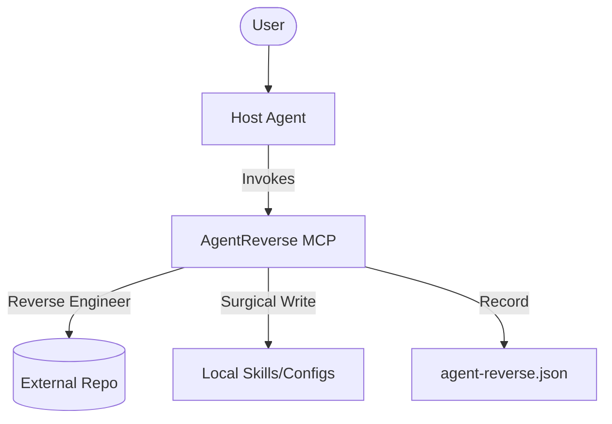

# 🧬 AgentReverse

[](https://modelcontextprotocol.io/)
[](#portability)
[](LICENSE)

> **"Stop the bloat. Maximize the context. Extract the DNA."**

**AgentReverse** is a surgical integration engine designed to eliminate agent/plugin bloat. Instead of cloning entire repositories just for a single feature, AgentReverse reverse-engineers tools, skills, and plugins to extract only the essential logic—surgically implanting them into your current workflow.

---

## ⚡ The Philosophy: "Every Token Counts"

In the era of AI agents, your **context window is your most valuable resource**.
Typical agent setups suffer from:

- **📦 Bloat**: Installing 100 files for 1 function.
- **📉 Context Shrinkage**: Redundant prompts and redundant code eating your token budget.
- **🧱 Fragmentation**: Skills scattered across GitHub with no unified way to sync them.

**AgentReverse solves this.** It treats agent capabilities like `requirements.txt` for Python—providing a leaner, faster, and smarter workflow.

---

## ✨ Key Features

- **🔬 Surgical Extraction**: Point to any GitHub repo, and AgentReverse isolates the "DNA" (tools, skills, or prompts) you actually need.
- **📑 Agent Requirements Manifest**: A universal `agent-reverse.json` file that tracks your capabilities, source commits, and dependencies.
- **🔄 Zero-Friction Sync**: Move from **Claude Code** to **Cursor** or **Antigravity**? One command restores your entire custom agent setup.
- **🧩 Synthesis Engine**: Detected a better way to do search in a new repo? AgentReverse can merge it with your existing tools to create a "superskill."
- **🕵️ Audit & Slim**: Scan your current messy `skills/` folders. Identify duplicates, find dead weight, and propose a consolidation plan.
- **📖 Research Interpreter**: Give it a blog post or a whitepaper (e.g., *Reasoning with Language Models*). It synthesizes the concept directly into a working agent skill.

---

## 🏗️ How It Works (Hybrid Architecture)

AgentReverse operates as a **Hybrid System**:

1. **MCP Server**: A universal engine that handles the "heavy lifting"—fetching repos, parsing ASTs, and managing the manifest.
2. **Skills Layer**: Proactive UX that lives inside your agent (Claude Code, etc.), observing your workflow and suggesting optimizations when things feel "high friction."



---

## 🌍 Agent Portability

Supported target systems:

- [x] **Claude Code** (`.claude/skills/`)
- [x] **Antigravity** (`skills/`)
- [x] **Cursor** (`.cursor/rules/`)
- [ ] **Custom Adapters** (Coming soon)

---

## 🚀 Usage Peek

### 🔍 Analyze a Repo

```bash
/agent-reverse analyze https://github.com/cool-user/search-plugin
```

*Result: A categorized "Bill of Materials" of every skill and tool inside.*

### 🧬 Extract & Install

```bash
/agent-reverse install search-lite --target claude
```

*Result: Installs the tool, updates CLAUDE.md, and pins the commit in your manifest.*

### 🔄 Sync Your Life

```bash
/agent-reverse sync
```

*Result: Re-plants all your capabilities into a fresh environment.*

---

## 🧪 Documentation

Explore the deep dives:

- 📄 [PRD](./docs/PRD.md) - Vision and roadmap.
- 🛠️ [Tech Spec](./docs/spec.md) - Architecture and JSON schemas.
- 📋 [Test Cases](./docs/test_case.md) - 15+ real-world usage scenarios.

---

## 🤝 Contributing

AgentReverse is for the community of "Vibe Coders" and Engineers who want a cleaner, faster Future of Coding. PRs for new **Agent Adapters** or **Language Parsers** are highly encouraged.

---

**Build smarter. Code leaner. Reverse the bloat.** 🧬✨
