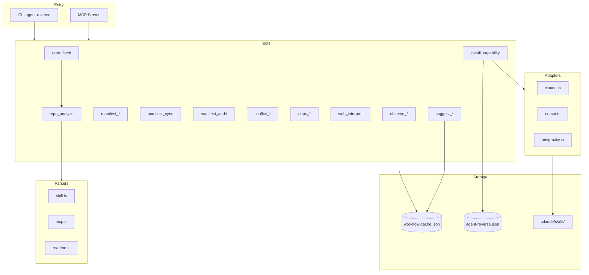
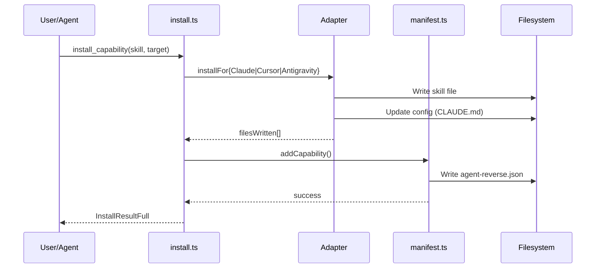
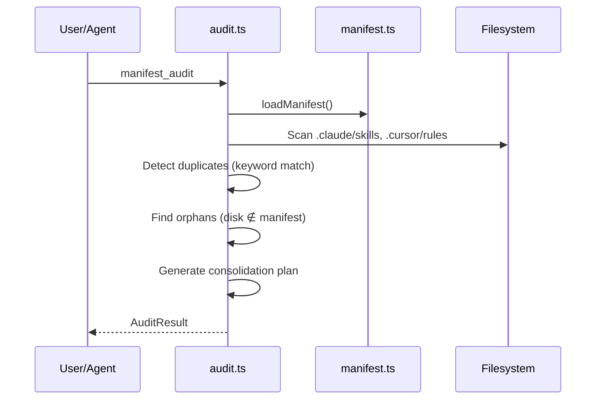
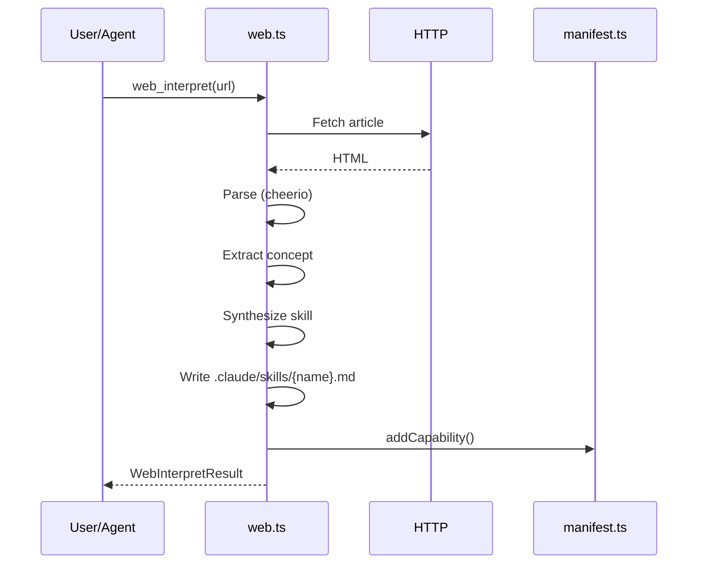

# Codebase Map

> Auto-generated by Cartographer. Last mapped: 2026-01-21

## System Overview

AgentReverse is a surgical integration tool that extracts agent capabilities from GitHub repos without bloat. It operates as a hybrid: MCP server (universal tools) + Skills layer (proactive UX).



## Directory Structure

```
src/
├── server.ts          # MCP server entry (registers all tools)
├── cli.ts             # CLI entry (analyze, install, sync, audit)
├── types.ts           # Shared TypeScript types
├── adapters/          # Target agent installers
│   ├── claude.ts      # → .claude/skills/*.md
│   ├── cursor.ts      # → .cursor/rules/*.mdc
│   └── antigravity.ts # → .agent/skills/*/SKILL.md
├── parsers/           # Content extractors
│   ├── mcp.ts         # Tree-sitter AST for server.tool()
│   ├── readme.ts      # README section extraction
│   └── skill.ts       # YAML frontmatter parsing
├── tools/             # MCP tool implementations
│   ├── fetch.ts       # repo_fetch, repo_cleanup
│   ├── analyze.ts     # repo_analyze
│   ├── manifest.ts    # manifest_add/remove/list/get
│   ├── install.ts     # install_capability
│   ├── sync.ts        # manifest_sync, check_updates
│   ├── observer.ts    # observe_event/patterns/clear
│   ├── suggester.ts   # suggest_capabilities
│   ├── audit.ts       # manifest_audit
│   ├── conflict.ts    # conflict_check/resolve
│   ├── deps.ts        # deps_check/resolve
│   └── web.ts         # web_interpret/fetch
└── data/
    └── default-repos.json  # Curated repo registry

tests/                     # 201 tests across 25 files
├── unit/                  # Isolated module tests (memfs)
│   ├── parsers/           # skill, mcp, readme tests
│   ├── adapters/          # claude, cursor, antigravity tests
│   └── tools/             # All 11 tool modules
├── integration/           # Cross-module workflows (5 files)
├── e2e/                   # Full system tests (2 files)
│   └── helpers/mcp-client.ts  # JSON-RPC stdio client
├── mocks/                 # factories.ts, git.ts, http.ts
└── helpers/setup.ts       # Virtual fs utilities

.github/workflows/
├── ci.yml                 # Build validation on push/PR
├── test.yml               # Full test suite (Node 20/22) + Codecov
└── publish.yml            # npm publish on v* tags
```

## Module Guide

### Core

| File | Purpose | Tokens |
|------|---------|--------|
| server.ts | MCP server entry, tool registration | 377 |
| cli.ts | CLI commands (analyze, install, sync, audit) | 2209 |
| types.ts | Capability, Manifest, ParsedSkill, AuditResult types | 801 |

### Parsers

| File | Purpose | Tokens |
|------|---------|--------|
| mcp.ts | Tree-sitter AST parsing for server.tool() calls | 1941 |
| skill.ts | YAML frontmatter + markdown body extraction | 476 |
| readme.ts | README section/dependency extraction | 1050 |

### Adapters

| File | Purpose | Tokens |
|------|---------|--------|
| claude.ts | Install to .claude/skills/, update CLAUDE.md | 1009 |
| cursor.ts | Install to .cursor/rules/*.mdc | 518 |
| antigravity.ts | Install to .agent/skills/ (project/global) | 526 |

### Tools (MCP)

| File | Purpose | MCP Tools | Tokens |
|------|---------|-----------|--------|
| fetch.ts | Clone repos, manage temp dirs | repo_fetch, repo_cleanup, repo_cleanup_all | 1038 |
| analyze.ts | Scan repo for skills/tools | repo_analyze | 1217 |
| manifest.ts | CRUD on agent-reverse.json | manifest_add/remove/list/get | 1530 |
| install.ts | Route to adapter, update manifest | install_capability | 1195 |
| sync.ts | Reinstall from manifest, check updates | manifest_sync, manifest_check_updates | 1377 |
| observer.ts | Log workflow events, detect friction | observe_event/patterns/clear | 1312 |
| suggester.ts | Generate capability suggestions | suggest_capabilities | 1652 |
| audit.ts | Detect duplicates, bloat, orphans | manifest_audit | 2147 |
| conflict.ts | Detect/resolve capability conflicts | conflict_check/resolve | 1849 |
| deps.ts | Dependency checking, resolution | deps_check/resolve | 1878 |
| web.ts | Article → skill synthesis | web_interpret, web_fetch | 2688 |

## MCP Tools Registry (25 total)

**Phase 1 - Core:**
`repo_fetch`, `repo_cleanup`, `repo_cleanup_all`, `repo_analyze`, `manifest_add`, `manifest_remove`, `manifest_list`, `manifest_get`, `install_capability`

**Phase 2 - Sync:**
`manifest_sync`, `manifest_check_updates`

**Phase 3 - Skills:**
`observe_event`, `observe_patterns`, `observe_clear`, `suggest_capabilities`

**Phase 4 - Advanced:**
`manifest_audit`, `conflict_check`, `conflict_resolve`, `deps_check`, `deps_resolve`

**Phase 5 - Web:**
`web_interpret`, `web_fetch`

## Data Flow

### Install Capability



### Audit Flow



### Web Synthesis



## Test Infrastructure

**Framework**: Vitest with v8 coverage (80% threshold)

**Test Commands**:
- `npm test` - All tests
- `npm run test:unit` - Unit only
- `npm run test:integration` - Integration only
- `npm run test:e2e` - E2E only (add `E2E_NETWORK=true` for network tests)
- `npm run test:coverage` - With coverage report

**Mock Patterns**:
- **Filesystem**: memfs via `vol.reset()` in beforeEach
- **Git**: simple-git mock with `mockGit.clone.mockImplementation()`
- **HTTP**: MSW (Mock Service Worker) for fetch interception
- **Factories**: `tests/mocks/factories.ts` for test data

**Test Categories**:
| Type | Files | Coverage |
|------|-------|----------|
| Unit | 17 | Parsers, adapters, all tools |
| Integration | 5 | fetch→install, sync, multi-agent, audit, observer |
| E2E | 2 | MCP server protocol, CLI workflows |

## CI/CD

**Workflows**:
- `ci.yml` - Build validation on push/PR to main
- `test.yml` - Full test matrix (Node 20/22), coverage → Codecov
- `publish.yml` - npm publish on `v*` tags

**npm Scripts**:
- `npm run build` - TypeScript compile
- `npm run dev` - Watch mode
- `npm run inspect` - MCP inspector

## Conventions

- **Tool registration**: `registerXXXTools(server)` pattern
- **Adapter interface**: `installForX(skill, workspaceRoot, capabilityId)`
- **Parser exports**: `parseXXX(content, filePath)` + helpers
- **Error handling**: Return `{ success, errors[] }` objects
- **Storage paths**: Relative to workspaceRoot (default: cwd)
- **Test setup**: `vol.reset()` + `vi.clearAllMocks()` in beforeEach
- **E2E isolation**: Real filesystem in `/tmp/agent-reverse-*-test`

## Gotchas

1. **Tree-sitter fallback**: mcp.ts uses regex when AST parsing fails
2. **Manifest auto-create**: loadManifest() creates default if missing
3. **Temp clones**: .tmp/ not auto-cleaned on crash - use repo_cleanup_all
4. **Conflict synthesis**: Currently template-based, no LLM merging
5. **Web synthesis**: Rule-based extraction, no semantic understanding

## Navigation Guide

**Add new MCP tool:**
1. Create `src/tools/newtool.ts` with `registerNewTool(server)`
2. Import + call in `src/server.ts`
3. Add types to `src/types.ts` if needed

**Add new target agent:**
1. Create `src/adapters/newagent.ts` with `installForNewAgent()`
2. Add case in `src/tools/install.ts` switch
3. Add to `TargetAgent` type in `src/types.ts`

**Add new parser:**
1. Create `src/parsers/newparser.ts`
2. Import in `src/tools/analyze.ts`
3. Add to `analyzeRepo()` flow

**Modify manifest schema:**
1. Update types in `src/types.ts` (Manifest, Capability)
2. Update `getDefaultManifest()` in `src/tools/manifest.ts`
3. Consider migration for existing manifests

**Add new tests:**
1. Unit: Create `tests/unit/<category>/<module>.test.ts`
2. Use factories from `tests/mocks/factories.ts`
3. Mock fs with memfs, git with simple-git mock
4. Integration: Add to `tests/integration/` for workflows
5. E2E: Extend `tests/e2e/server.test.ts` or `workflow.test.ts`
