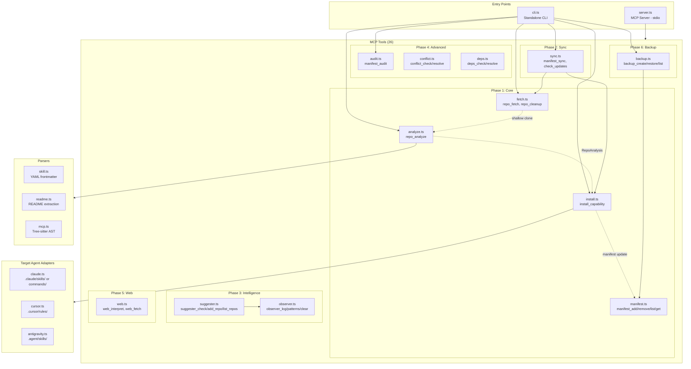
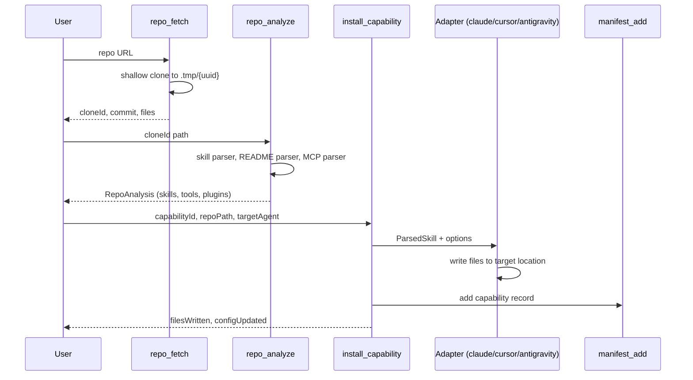
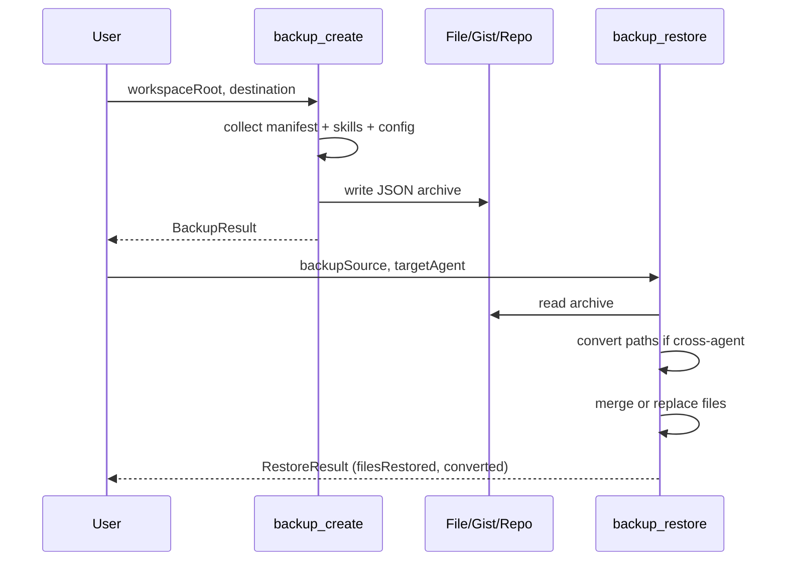

# Codebase Map

> Auto-generated by Cartographer.

## System Overview



## Directory Structure

```
src/
├── server.ts           # MCP server entry (26 tools registered via stdio)
├── cli.ts              # CLI entry (10 commands, auto-detects target agent)
├── types.ts            # 30+ types/interfaces (Capability, Manifest, RepoAnalysis, etc.)
├── tools/              # MCP tool implementations
│   ├── fetch.ts        # repo_fetch (shallow clone), repo_cleanup
│   ├── analyze.ts      # repo_analyze (multi-parser: skill→README→package.json→MCP)
│   ├── manifest.ts     # manifest_add/remove/list/get (agent-reverse.json CRUD)
│   ├── install.ts      # install_capability (routes to adapter by target agent)
│   ├── sync.ts         # manifest_sync (reinstall all), check_updates (git ls-remote)
│   ├── observer.ts     # observer_log/get_patterns/clear (workflow-cache.json)
│   ├── suggester.ts    # suggester_check/add_repo/list_repos (pattern→repo matching)
│   ├── audit.ts        # manifest_audit (duplicates, bloat, orphans)
│   ├── conflict.ts     # conflict_check/resolve (replace/keep_both/synthesize)
│   ├── deps.ts         # deps_check/resolve (DFS cycle detection, topological sort)
│   ├── web.ts          # web_interpret/web_fetch (cheerio scraping → skill synthesis)
│   └── backup.ts       # backup_create/restore/list (file/gist/repo destinations)
├── adapters/           # Target agent installers
│   ├── claude.ts       # .claude/skills/ or .claude/commands/ + CLAUDE.md update
│   ├── cursor.ts       # .cursor/rules/*.mdc (self-contained MDC format)
│   └── antigravity.ts  # .agent/skills/{id}/SKILL.md or ~/.gemini/antigravity/skills/
├── parsers/
│   ├── skill.ts        # YAML frontmatter extraction, isSkillPath() heuristic
│   ├── readme.ts       # Section extraction (install, usage, deps) via regex
│   └── mcp.ts          # Tree-sitter AST parsing with regex fallback
└── data/
    └── default-repos.json  # 3 seed repos for suggester
```

```
tests/
├── unit/               # 18 files, 186 tests
│   ├── parsers/        # skill, readme, mcp
│   ├── adapters/       # claude, cursor, antigravity
│   ├── tools/          # all 12 tool modules
│   └── smoke.test.ts
├── integration/        # 5 files, 22 tests
│   ├── fetch-analyze-install.test.ts
│   ├── manifest-sync.test.ts
│   ├── audit-conflict.test.ts
│   ├── multi-agent.test.ts
│   └── observer-suggester.test.ts
├── e2e/                # 2 files, 13 tests
│   ├── helpers/mcp-client.ts
│   ├── server.test.ts
│   └── workflow.test.ts
├── mocks/              # factories.ts, git.ts, http.ts
├── helpers/            # setup.ts (global test setup)
└── fixtures/           # .gitkeep
```

## Module Guide

### Core (src/)

| File | Purpose | Key Exports |
|------|---------|-------------|
| server.ts | MCP server entry, registers 26 tools via stdio | (executable) |
| cli.ts | Standalone CLI with 10 commands, auto-detects workspace agent | (executable) |
| types.ts | 30+ types: Capability, Manifest, RepoAnalysis, AuditResult, ConflictInfo, etc. | All types |

**server.ts** registers tools in phase order (1-6), version `0.1.0`, stdio transport.

**cli.ts** commands: setup, analyze, install, sync, check-updates, audit, list, backup, restore, help. Supports `--json` output. `detectTargetAgent()` checks for `.claude/`, `.cursor/`, `.agent/` dirs.

### Parsers (src/parsers/)

| File | Input | Output | Method |
|------|-------|--------|--------|
| skill.ts | Markdown files | ParsedSkill | Regex + js-yaml |
| readme.ts | README.md | ReadmeInfo (title, desc, install, deps) | Section regex |
| mcp.ts | .ts/.js files | ExtractedMcpTool[] | Tree-sitter AST + regex fallback |

**skill.ts**: `isSkillPath()` matches `/skills/`, `/prompts/` dirs, excludes README/CHANGELOG. `parseSkillFile()` extracts YAML frontmatter + body content.

**mcp.ts**: Detects `server.tool()`, `server.registerTool()`, `server.setRequestHandler()` calls. Extracts name, description, inputSchema keys. Scans for server files matching `server.ts`, `index.ts`, `mcp*.ts`.

### Adapters (src/adapters/)

| Adapter | Output Location | Format | Config Update |
|---------|----------------|--------|---------------|
| claude.ts | `.claude/skills/` or `.claude/commands/` | Markdown + YAML | CLAUDE.md |
| cursor.ts | `.cursor/rules/` | MDC + YAML | None (self-contained) |
| antigravity.ts | `.agent/skills/{id}/` or `~/.gemini/.../` | Markdown + YAML | None |

**claude.ts**: Routes by `userInvocable` flag to commands/ vs skills/. Adds `agent-reverse-id` to frontmatter. Appends to `## AgentReverse Capabilities` in CLAUDE.md.

**antigravity.ts**: Creates subdirectory per skill with `SKILL.md` inside. Supports project and global scope.

### Tools (src/tools/)

#### Phase 1 - Core (8 tools)

| Tool | File | Purpose |
|------|------|---------|
| `repo_fetch` | fetch.ts | Shallow clone (`--depth 1`) to `.tmp/{uuid}`, return commit + files |
| `repo_cleanup` | fetch.ts | Remove clone by ID from in-memory `Map<cloneId, path>` |
| `repo_analyze` | analyze.ts | Multi-parser scan: skills (w/ userInvocable flag), README, package.json, MCP tools |
| `manifest_add` | manifest.ts | Add capability, auto-supersede on version change |
| `manifest_remove` | manifest.ts | Remove by ID, return files for cleanup |
| `manifest_list` | manifest.ts | List all capabilities |
| `manifest_get` | manifest.ts | Get capability by ID |
| `install_capability` | install.ts | Parse skill, route to adapter (userInvocable override), update manifest |

#### Phase 2 - Sync (2 tools)

| Tool | File | Purpose |
|------|------|---------|
| `manifest_sync` | sync.ts | Re-fetch + reinstall all capabilities |
| `manifest_check_updates` | sync.ts | `git ls-remote` to compare pinned vs HEAD |

#### Phase 3 - Intelligence (6 tools)

| Tool | File | Purpose |
|------|------|---------|
| `observer_log` | observer.ts | Record workflow event, deduplicate, auto-prune >30 days |
| `observer_get_patterns` | observer.ts | Query patterns by type, min frequency |
| `observer_clear` | observer.ts | Reset workflow-cache.json |
| `suggester_check` | suggester.ts | Match patterns to repos, return top 5 suggestions |
| `suggester_add_repo` | suggester.ts | Add repo to known-repos.json watch list |
| `suggester_list_repos` | suggester.ts | List default + user repos |

#### Phase 4 - Advanced (6 tools)

| Tool | File | Purpose |
|------|------|---------|
| `manifest_audit` | audit.ts | Detect duplicates (keyword matching), bloat, orphans |
| `conflict_check` | conflict.ts | Check if capability ID already exists |
| `conflict_resolve` | conflict.ts | Strategies: replace, keep_both, synthesize (merge) |
| `deps_check` | deps.ts | Check if dependencies satisfied |
| `deps_resolve` | deps.ts | DFS cycle detection + topological sort for install order |

**conflict.ts** synthesize strategy: merges content into `.claude/skills/{merged-name}.md`, marks source as `synthesized`.

**deps.ts**: Parses frontmatter `dependencies` field. Builds full graph, detects cycles via recursion stack.

#### Phase 5 - Web (2 tools)

| Tool | File | Purpose |
|------|------|---------|
| `web_interpret` | web.ts | Fetch, extract concept, synthesize skill, write + manifest |
| `web_fetch` | web.ts | Fetch + parse article only (no synthesis) |

**web.ts**: Cheerio HTML scraping. Removes nav/footer/sidebar. Content selectors: article, main, .content, body. Limits: 10k chars, 500 char code blocks. Categories: search, reasoning, code, data, workflow, testing, documentation.

#### Phase 6 - Backup (3 tools)

| Tool | File | Purpose |
|------|------|---------|
| `backup_create` | backup.ts | Archive to local file, GitHub Gist, or GitHub repo |
| `backup_restore` | backup.ts | Restore with optional cross-agent path conversion |
| `backup_list` | backup.ts | Preview backup contents without restoring |

**backup.ts**: Includes manifest, skills/commands/rules, CLAUDE.md, workflow-cache.json, known-repos.json. Gist via `gh gist create`. Merge vs replace modes. Dry-run support.

## Data Flow

### Install Capability



### Backup/Restore Flow



## Test Infrastructure

**Framework**: Vitest with v8 coverage | **201 tests** across 25 files

**Coverage Thresholds**: 75% statements, 60% branches, 65% functions, 75% lines

| Layer | Files | Tests |
|-------|-------|-------|
| Unit | 18 | 186 |
| Integration | 5 | 22 |
| E2E | 2 | 13 |

**Mock Patterns**:
- **Filesystem**: memfs via `vol.reset()` in beforeEach
- **Git**: simple-git mock with `mockGit.clone.mockImplementation()`
- **HTTP**: MSW (Mock Service Worker) for fetch interception
- **Factories**: `tests/mocks/factories.ts` for test data

**Commands**: `npm test` | `npm run test:unit` | `npm run test:integration` | `npm run test:e2e` | `npm run test:coverage`

**E2E**: Custom MCP test client (`tests/e2e/helpers/mcp-client.ts`), requires `npm run build` first, `E2E_NETWORK=true` for network tests.

## Key Files

| File | Purpose |
|------|---------|
| `agent-reverse.json` | Capability manifest (installed capabilities) |
| `workflow-cache.json` | Observer patterns (auto-pruned >30 days) |
| `known-repos.json` | User's watched repos for suggester |
| `src/data/default-repos.json` | 3 seed repos (claude-code, mcp/servers, anthropic-cookbook) |
| `vitest.config.ts` | Test config (v8 coverage, thresholds) |
| `tsconfig.json` | ES2022/Node16 modules, strict, sourceMap |

## Conventions

- **Tool registration**: Each tool file exports `register*Tool(s)(server)` function
- **Error handling**: try-catch returning `{ isError: true, content: [...] }` MCP response
- **JSON responses**: 2-space indent via `JSON.stringify(result, null, 2)`
- **Manifest versioning**: Duplicate ID + different commit marks old as `superseded`
- **File paths**: All workspace-relative, resolved via `path.join(workspaceRoot, ...)`
- **Capability status lifecycle**: `pending` → `installed` → `superseded`

## Gotchas

- `server.ts` version is `0.1.0` while `package.json` is `1.2.0`
- `cli.ts` setup installs bundled skills from `skills/` directory (not `src/`)
- `web.ts` truncates article content to 10,000 chars
- `deps.ts` autoInstall is stubbed (reports only, doesn't install)
- `suggester.ts` excluded from coverage thresholds
- Tree-sitter in `mcp.ts` silently falls back to regex on parse failure
- Clone tracking in `fetch.ts` is in-memory only (lost on server restart)

## Navigation Guide

| Want to... | Start at |
|-----------|----------|
| Add a new MCP tool | Create `src/tools/{name}.ts`, register in `src/server.ts` |
| Support a new agent | Create `src/adapters/{name}.ts`, add to `install.ts` router |
| Add a new parser | Create `src/parsers/{name}.ts`, integrate in `analyze.ts` |
| Add tests | Mirror source path in `tests/unit/`, use memfs + factories |
| Debug tool registration | Check `src/server.ts` phase comments |
| Understand data flow | Follow fetch, analyze, install, manifest chain |
| Add CLI command | Add `cmd*` function in `cli.ts`, wire in arg parser |
