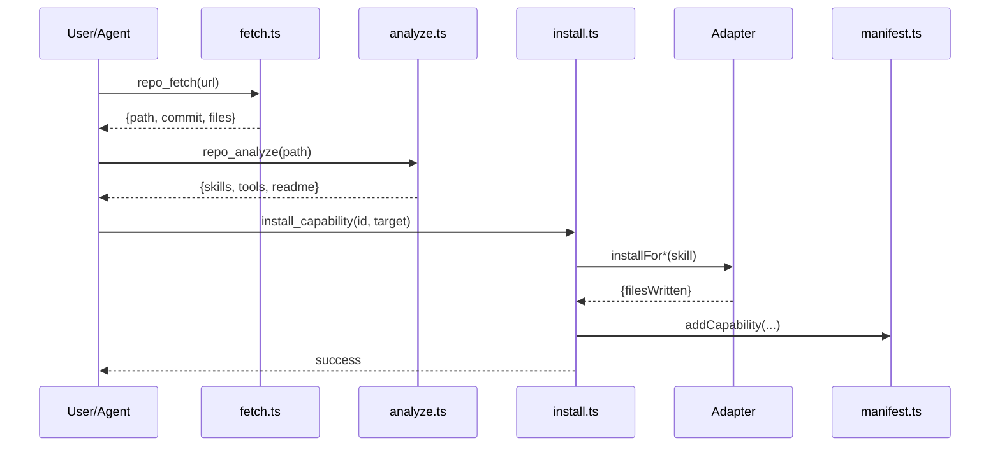
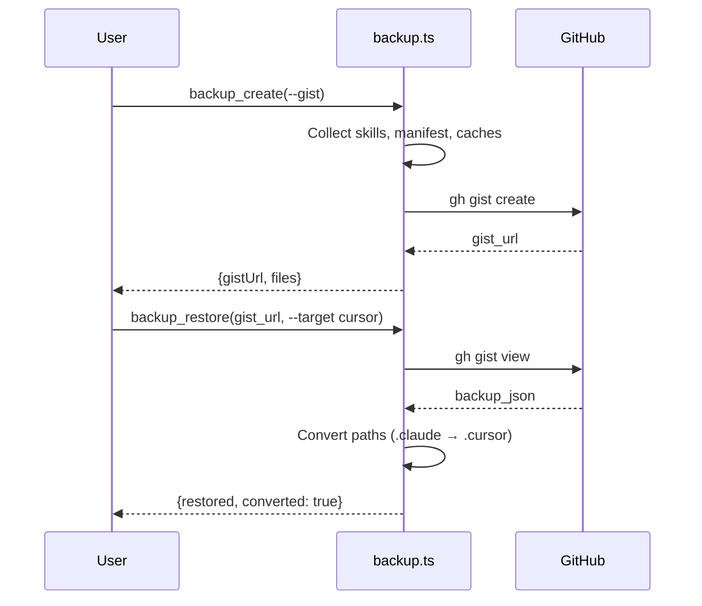

# Codebase Map

> Auto-generated by Cartographer. Last mapped: 2026-01-31

## System Overview

AgentReverse is an MCP server for surgical extraction of agent capabilities from GitHub repos. Prevents bloat by installing only what you need.

```mermaid
flowchart TB
    subgraph "Entry Points"
        CLI[cli.ts<br/>CLI Interface]
        MCP[server.ts<br/>MCP Server]
    end

    subgraph "Tools Layer (26 MCP tools)"
        subgraph "Phase 1 - Core"
            fetch[fetch.ts<br/>repo_fetch, repo_cleanup]
            analyze[analyze.ts<br/>repo_analyze]
            manifest[manifest.ts<br/>manifest_add/remove/list/get]
            install[install.ts<br/>install_capability]
        end
        subgraph "Phase 2 - Sync"
            sync[sync.ts<br/>manifest_sync, check_updates]
        end
        subgraph "Phase 3 - Intelligence"
            observer[observer.ts<br/>observer_log/get/clear]
            suggester[suggester.ts<br/>suggester_check/add/list]
        end
        subgraph "Phase 4 - Advanced"
            audit[audit.ts<br/>manifest_audit]
            conflict[conflict.ts<br/>conflict_check/resolve]
            deps[deps.ts<br/>deps_check/resolve]
        end
        subgraph "Phase 5 - Web"
            web[web.ts<br/>web_interpret, web_fetch]
        end
        subgraph "Phase 6 - Backup"
            backup[backup.ts<br/>backup_create/restore/list]
        end
    end

    subgraph "Parsers"
        skill[skill.ts<br/>YAML frontmatter]
        readme[readme.ts<br/>README extraction]
        mcp[mcp.ts<br/>Tree-sitter AST]
    end

    subgraph "Adapters"
        claude[claude.ts<br/>.claude/skills/]
        cursor[cursor.ts<br/>.cursor/rules/]
        antigravity[antigravity.ts<br/>.agent/skills/]
    end

    CLI --> fetch & analyze & install & sync & manifest & backup
    MCP --> fetch & analyze & manifest & install & sync & observer & suggester & audit & conflict & deps & web & backup

    analyze --> skill & readme & mcp
    install --> claude & cursor & antigravity
    backup --> claude & cursor & antigravity
```



## Directory Structure

```
agent-reverse/
├── src/
│   ├── server.ts          # MCP server entry (registers 26 tools)
│   ├── cli.ts              # CLI entry (9 commands)
│   ├── types.ts            # 26 shared type definitions
│   ├── tools/              # MCP tools (12 files)
│   │   ├── fetch.ts        # repo_fetch, repo_cleanup
│   │   ├── analyze.ts      # repo_analyze
│   │   ├── manifest.ts     # manifest_add/remove/list/get
│   │   ├── install.ts      # install_capability
│   │   ├── sync.ts         # manifest_sync, manifest_check_updates
│   │   ├── observer.ts     # observer_log/get_patterns/clear
│   │   ├── suggester.ts    # suggester_check/add_repo/list_repos
│   │   ├── audit.ts        # manifest_audit
│   │   ├── conflict.ts     # conflict_check/resolve
│   │   ├── deps.ts         # deps_check/resolve
│   │   ├── web.ts          # web_interpret, web_fetch
│   │   └── backup.ts       # backup_create/restore/list
│   ├── adapters/           # Target agent installers
│   │   ├── claude.ts       # Claude Code → .claude/skills/ or .claude/commands/
│   │   ├── cursor.ts       # Cursor → .cursor/rules/*.mdc
│   │   └── antigravity.ts  # Antigravity → .agent/skills/{id}/SKILL.md
│   ├── parsers/            # Content extractors
│   │   ├── skill.ts        # YAML frontmatter parser
│   │   ├── readme.ts       # README.md section extractor
│   │   └── mcp.ts          # Tree-sitter AST parser for MCP tools
│   └── data/
│       └── default-repos.json  # Built-in repo registry
├── tests/
│   ├── unit/               # 186 unit tests
│   ├── integration/        # 22 integration tests
│   ├── e2e/                # 13 e2e tests
│   ├── mocks/              # fs, git, http mocks
│   ├── helpers/            # Test utilities
│   └── fixtures/           # Sample test data
├── skills/                 # Bundled skills (installed via CLI setup)
└── docs/
    ├── CODEBASE_MAP.md     # This file
    ├── PRD.md              # Product requirements
    ├── spec.md             # Technical specification
    ├── BRANCHES.md         # Phase development plan
    └── plans/              # Design documents per phase
```

## Module Guide

### Core (src/)

| File | Purpose | Exports |
|------|---------|---------|
| server.ts | MCP server entry point | main() - starts stdio transport |
| cli.ts | CLI interface | 9 commands: setup, analyze, install, sync, check-updates, audit, list, backup, restore |
| types.ts | Type definitions | 26 types/interfaces for capabilities, manifest, parsers, backup |

### Parsers (src/parsers/)

| File | Purpose | Key Function |
|------|---------|--------------|
| skill.ts | YAML frontmatter extraction | `parseSkillFile()` → ParsedSkill |
| readme.ts | README section parsing | `parseReadme()` → ReadmeInfo (title, deps, install steps) |
| mcp.ts | Tree-sitter AST parsing | `parseMcpTools()` → ExtractedMcpTool[] (tool name, schema, line) |

### Adapters (src/adapters/)

| File | Target Dir | File Format | Config Update |
|------|-----------|-------------|---------------|
| claude.ts | `.claude/skills/` or `.claude/commands/` | `{id}.md` with frontmatter | Updates CLAUDE.md |
| cursor.ts | `.cursor/rules/` | `{id}.mdc` (MDC format) | None (auto-discovered) |
| antigravity.ts | `.agent/skills/{id}/` or `~/.gemini/antigravity/` | `SKILL.md` | None (auto-discovered) |

### Tools (src/tools/)

| File | MCP Tools | Purpose |
|------|-----------|---------|
| fetch.ts | `repo_fetch`, `repo_cleanup` | Shallow clone repos to .tmp/ |
| analyze.ts | `repo_analyze` | Extract skills, MCP tools, README info |
| manifest.ts | `manifest_add`, `manifest_remove`, `manifest_list`, `manifest_get` | CRUD for agent-reverse.json |
| install.ts | `install_capability` | Route to adapter, update manifest |
| sync.ts | `manifest_sync`, `manifest_check_updates` | Reinstall all, check for updates |
| observer.ts | `observer_log`, `observer_get_patterns`, `observer_clear` | Track workflow patterns |
| suggester.ts | `suggester_check`, `suggester_add_repo`, `suggester_list_repos` | Proactive capability suggestions |
| audit.ts | `manifest_audit` | Detect duplicates, orphans, bloat |
| conflict.ts | `conflict_check`, `conflict_resolve` | Handle ID conflicts (replace/keep_both/synthesize) |
| deps.ts | `deps_check`, `deps_resolve` | Dependency graph, cycle detection, install order |
| web.ts | `web_interpret`, `web_fetch` | Article → skill synthesis |
| backup.ts | `backup_create`, `backup_restore`, `backup_list` | Cross-agent backup/restore |

## MCP Tools Registry (26 total)

**Phase 1 - Core (8 tools):**
- `repo_fetch`, `repo_cleanup` - Clone/cleanup repos
- `repo_analyze` - Extract capabilities from repo
- `manifest_add`, `manifest_remove`, `manifest_list`, `manifest_get` - Manifest CRUD
- `install_capability` - Install to target agent

**Phase 2 - Sync (2 tools):**
- `manifest_sync` - Reinstall all capabilities
- `manifest_check_updates` - Check for outdated commits

**Phase 3 - Intelligence (6 tools):**
- `observer_log`, `observer_get_patterns`, `observer_clear` - Workflow tracking
- `suggester_check`, `suggester_add_repo`, `suggester_list_repos` - Suggestions

**Phase 4 - Advanced (6 tools):**
- `manifest_audit` - Detect duplicates/orphans/bloat
- `conflict_check`, `conflict_resolve` - Handle conflicts
- `deps_check`, `deps_resolve` - Dependency resolution

**Phase 5 - Web (2 tools):**
- `web_interpret` - Full fetch→extract→synthesize→install pipeline
- `web_fetch` - Fetch and parse only

**Phase 6 - Backup (3 tools):**
- `backup_create` - Create backup (file/gist/repo)
- `backup_restore` - Restore with cross-agent conversion
- `backup_list` - Preview backup contents

## Data Flow

### Install Capability



### Backup/Restore Flow



## Test Infrastructure

**Framework**: Vitest with v8 coverage

**Coverage Thresholds**: 75% statements, 60% branches, 65% functions, 75% lines

**Test Distribution**:
- Unit: 186 tests (19 files)
- Integration: 22 tests (5 files)
- E2E: 13 tests (2 files)

**Mock Patterns**:
- **Filesystem**: memfs via `vol.reset()` in beforeEach
- **Git**: simple-git mock with `mockGit.clone.mockImplementation()`
- **HTTP**: MSW (Mock Service Worker) for fetch interception
- **Factories**: `tests/mocks/factories.ts` for test data

**Test Commands**:
```bash
npm test              # Run all tests
npm run test:unit     # Unit tests only
npm run test:coverage # With coverage report
```

## Key Files

| File | Purpose |
|------|---------|
| `agent-reverse.json` | Manifest (installed capabilities) |
| `workflow-cache.json` | Observer patterns |
| `known-repos.json` | User's watched repos |
| `CLAUDE.md` | Updated with capability hints |

## Conventions

- **Error accumulation**: Tools collect errors in arrays vs throwing
- **Result objects**: Structured returns with `success`, `errors`, metadata
- **Workspace root**: All tools accept optional `workspaceRoot` param (default: cwd)
- **MCP registration**: Each tool file exports `register*Tools(server)` function
- **Zod validation**: All tool inputs validated with zod schemas

## Gotchas

- **Shallow clones**: `repo_fetch` uses `--depth 1` for speed
- **Clone cleanup**: Remember to call `repo_cleanup` after install
- **Commit pinning**: Capabilities pin to specific commit, use `check_updates` to detect drift
- **Supersede tracking**: Updating capability moves old version to `superseded` array
- **User-invocable**: Skills with `user-invocable: true` go to `.claude/commands/` not `.claude/skills/`

## Navigation Guide

| Task | Start Here |
|------|------------|
| Add new MCP tool | `src/tools/` → create file → register in `server.ts` |
| Support new agent | `src/adapters/` → implement `installFor*()` |
| Parse new content type | `src/parsers/` → export parse function |
| Add CLI command | `src/cli.ts` → add case in switch |
| Test a tool | `tests/unit/tools/{tool}.test.ts` |
