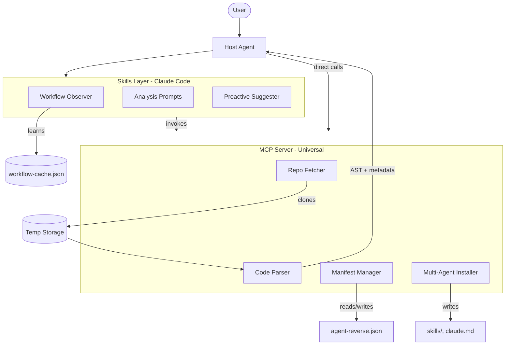
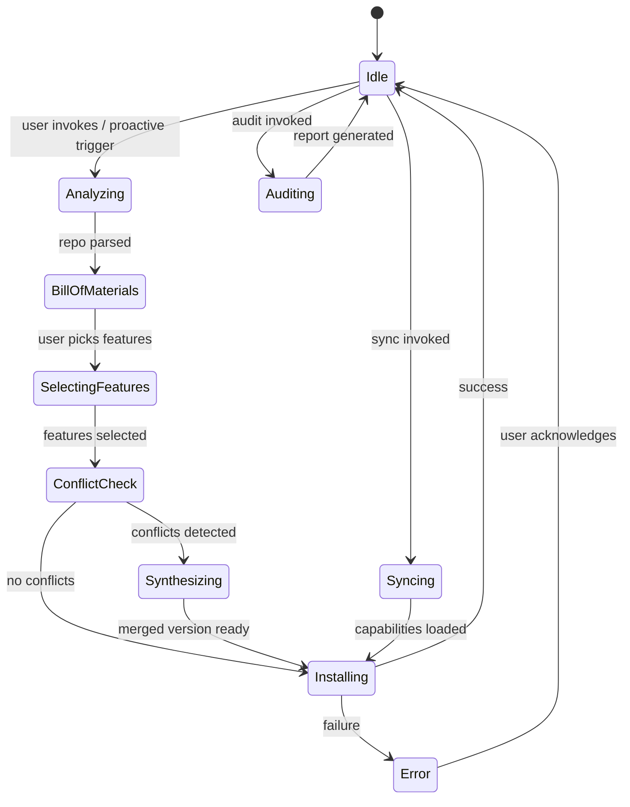

# Tech Spec: AgentReverse

## System Architecture

AgentReverse is a **hybrid system**: an MCP server (universal tools) + Skills layer (proactive UX). No external LLM calls—host agent performs analysis using AgentReverse's tools.



## State Machine



---

## Layer 1: MCP Server (Universal)

### Tools Exposed

| Tool | Description | Input | Output |
|------|-------------|-------|--------|
| `repo_fetch` | Shallow clone repo, pin commit | `url`, `branch?` | `{ path, commit, files[] }` |
| `repo_analyze` | Parse repo for capabilities | `path` | `{ skills[], tools[], plugins[] }` |
| `manifest_add` | Add capability to manifest | `capability` | `{ success, id }` |
| `manifest_remove` | Remove capability | `id` | `{ success, filesDeleted[] }` |
| `manifest_sync` | Reinstall all capabilities | `targetAgent?` | `{ installed[], failed[] }` |
| `manifest_audit` | Scan for bloat/duplicates | `paths[]` | `{ duplicates[], bloat[], plan }` |
| `manifest_check_updates` | Compare pinned vs HEAD | - | `{ outdated[] }` |
| `install_capability` | Write extracted files | `capability`, `targetAgent` | `{ filesWritten[] }` |

### 1.1 Repo Fetcher

- Shallow clone via `git clone --depth 1`
- Returns exact commit hash for pinning
- Stores in temp dir, auto-cleanup after session

### 1.2 Code Parser

- **Engine**: Tree-sitter (TypeScript, Python, Go) + regex fallback
- **Extracts**:
  - MCP tool definitions (`server.tool(...)`)
  - Skill markdown (`.md` files with frontmatter)
  - Function signatures + docstrings
  - README install instructions
  - Package dependencies

### 1.3 Manifest Manager

**File**: `agent-reverse.json` at workspace root

```json
{
  "version": "1.0",
  "targetAgent": "claude-code",
  "capabilities": [
    {
      "id": "google-search-lite",
      "source": "https://github.com/example/mcp-search",
      "commit": "a1b2c3d",
      "files": ["skills/search.md"],
      "dependencies": [],
      "status": "installed",
      "extractedFrom": "tools/search.ts",
      "installedAt": "2024-01-15T10:30:00Z"
    }
  ],
  "superseded": []
}
```

### 1.4 Multi-Agent Installer

Adapts output per target agent:

| Agent | Skills Location | Config File | Notes |
|-------|-----------------|-------------|-------|
| Claude Code | `.claude/skills/` | `CLAUDE.md` | Append usage to CLAUDE.md |
| Antigravity | `skills/` | `agent.md` | |
| Cursor | `.cursor/rules/` | `.cursorrules` | Convert to rule format |
| Custom | configurable | configurable | |

### 1.5 Conflict Resolution Engine

When `manifest_add` detects duplicate ID:
1. Compare source URLs and commits
2. If identical → skip (already installed)
3. If different → trigger synthesis mode
4. Host agent analyzes both, produces merged version
5. Mark old as `superseded`, install merged

---

## Layer 2: Skills Layer (Claude Code)

### 2.1 Workflow Observer

**File**: `workflow-cache.json` (local)

```json
{
  "patterns": [
    {
      "trigger": "user searches for 'how to X'",
      "frequency": 5,
      "lastSeen": "2024-01-15T09:00:00Z",
      "suggestion": "extract X capability from repo Y"
    }
  ],
  "installedCapabilities": ["search-lite", "code-review"],
  "sessionHistory": []
}
```

**Observation hooks**:
- Tool invocations (which tools used frequently)
- Error patterns (repeated failures = friction)
- Search queries (indicates missing capability)
- File access patterns (which repos referenced)

### 2.2 Analysis Prompts (Skills)

Skills that guide Claude through extraction:

**`/agent-reverse analyze <url>`**
- Invoke `repo_fetch` + `repo_analyze`
- Present Bill of Materials
- Ask user which features to extract

**`/agent-reverse install <id>`**
- Pull from analyzed repo
- Run conflict check
- Install and update manifest

**`/agent-reverse sync`**
- Read manifest
- Reinstall all for current agent system

**`/agent-reverse audit`**
- Scan local skills/plugins
- Report bloat and duplicates
- Propose consolidation

### 2.3 Proactive Suggester

Triggered when:
- Workflow cache shows repeated friction pattern
- User mentions capability that exists in known repos
- Detected overlap between installed capabilities

Output: non-intrusive suggestion, e.g.:
> "Noticed you've searched for X 3 times. Repo Y has a lightweight version—want me to analyze it?"

---

## Implementation Phases

### Phase 1: MCP Core

Deliverables:
- `repo_fetch` tool
- `repo_analyze` tool (basic: skill markdown, README)
- `manifest_add` / `manifest_remove`
- `install_capability` (Claude Code target only)

Test case: Extract a full plugin from community repo

### Phase 2: Multi-Agent + Sync

Deliverables:
- Multi-agent installer (Cursor, Antigravity adapters)
- `manifest_sync` tool
- `manifest_check_updates`

Test case: Sync manifest to clean environment

### Phase 3: Skills Layer

Deliverables:
- `/agent-reverse` skill command
- Workflow observer (basic patterns)
- Proactive suggester (v1)

Test case: Observer suggests capability after repeated friction

### Phase 4: Advanced

Deliverables:
- Conflict resolution + synthesis
- `manifest_audit` with consolidation plans
- Deep parser (Tree-sitter AST for MCP tools)
- Dependency resolution

---

## Security Considerations

- **Source verification**: Warn on non-GitHub sources, unsigned commits
- **Isolated storage**: Temp clones wiped post-extraction
- **No remote execution**: Parse and write only, never run source code
- **Manifest pinning**: Always pin to specific commit, warn on HEAD-only

---

## Tech Stack

| Component | Technology |
|-----------|------------|
| MCP Server | TypeScript, @modelcontextprotocol/sdk |
| Parser | Tree-sitter bindings (node-tree-sitter) |
| Git ops | simple-git |
| Skills | Markdown + YAML frontmatter |
| Storage | Local JSON files |

---

## File Structure

```
agent-reverse/
├── src/
│   ├── server.ts          # MCP server entry
│   ├── tools/
│   │   ├── fetch.ts       # repo_fetch
│   │   ├── analyze.ts     # repo_analyze
│   │   ├── manifest.ts    # manifest_* tools
│   │   └── install.ts     # install_capability
│   ├── parsers/
│   │   ├── skill.ts       # skill markdown parser
│   │   ├── mcp.ts         # MCP tool extractor
│   │   └── readme.ts      # README instruction parser
│   └── adapters/
│       ├── claude.ts      # Claude Code installer
│       ├── cursor.ts      # Cursor installer
│       └── antigravity.ts # Antigravity installer
├── skills/
│   └── agent-reverse.md   # Main skill file
├── package.json
└── tsconfig.json
```
